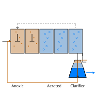

# ASPDemo

This project is an Activated Sludge Process (ASP) wastewater treatment plant model. It implements the IWA/COST Benchmark Simulation Model No. 1 (BSM1), consisting of a 5-tank biological reactor train — 2 anoxic denitrification tanks followed by 3 aerobic nitrification tanks — feeding into a 10-layer Takacs secondary clarifier with return/waste sludge and internal recycle loops. The plant includes PI controllers for dissolved oxygen (via blower aeration) and nitrate (via internal recycle flow), along with sensors, pumps, mixers, dividers, and flow sources that read influent data from CSV files. All ~40 custom components (connectors, reactor kinetics based on ASM1, sedimentation layers, hydraulic elements, and control blocks) are implemented from scratch in Dyad with individual test harnesses. Two top-level plant configurations exist: `BenchPlant` (with default kinetics) and `BenchPlantCOST` (with COST benchmark-specific kinetic parameters).

The tradeoff of interest is how clean the water is after treatment and how much relative energy was expended in doing so.  The former is measured by the chemical oxygen demand (COD) from the `sensor_effluent` component and the latter is measured by the air flow rates from the `blower1`, `blower2`, and `blower3` components.

## Getting Started

Download this folder to your machine and open it in VS Code with the [Dyad extension](https://help.juliahub.com/dyad/dev/getting_started/).

## Running Experiments

**`scripts/main.jl`** loads the library, simulates the `simbenchplant` analysis using the `BenchPlant` model.  Plotting commands are provided to plot variables of interest.

## Models
`BenchPlant` is a wastewater treatment plant model representing the BSM1 (Benchmark Simulation Model No. 1) activated sludge process, consisting of a five-tank biological reactor train (two anoxic denitrification tanks followed by three aerated nitrification tanks) feeding a secondary clarifier, with internal recycle and return sludge loops controlled by PI controllers regulating dissolved oxygen and nitrate levels.  The `BenchPlant` model is made up of the following components:

#### BenchPlant Components (17 unique types, 30 instances)

| Instance(s) | Type | Count | Role |
|---|---|---|---|
| `source` | `FlowSourceFile` | 1 | Influent wastewater input from CSV file |
| `mixer` | `Mixer3` | 1 | 3-input mixer (influent + return sludge + internal recycle) |
| `tank1`, `tank2` | `Denitrification` | 2 | Anoxic biological reactor tanks |
| `tank3`, `tank4`, `tank5` | `Nitrification` | 3 | Aerated biological reactor tanks (V=1333 each) |
| `divider` | `Divider2` | 1 | Splits flow into settler feed and internal recycle |
| `settler` | `SecondaryClarifierTakacs` | 1 | Secondary clarifier (Takács settling model) |
| `recyclePump` | `Pump` | 1 | Internal recycle pump (Q_max=92230) |
| `returnPump` | `Pump` | 1 | Return sludge pump (Q_max=18446) |
| `wastePump` | `Pump` | 1 | Waste sludge pump (Q_max=385) |
| `sinkWaste` | `SludgeSink` | 1 | Waste sludge disposal sink |
| `sinkEffluent` | `EffluentSink` | 1 | Treated effluent discharge sink |
| `blower1`, `blower2`, `blower3` | `Blower` | 3 | Air blowers for aeration (Q_max≈34574 each) |
| `sensor_NO`, `sensor_O2`, `sensor_TSS1`, `sensor_effluent` | `CombinedSensor` | 4 | Wastewater quality sensors |
| `constant1`, `constant2`, `temperature`, `nitrogenSetpoint` | `BlockComponents.Constant` | 4 | Constant signal sources (blower/pump commands, temperature=15, NO setpoint=1) |
| `oxygenSetpoint` | `BlockComponents.Step` | 1 | Dissolved oxygen setpoint (step of height 2) |
| `PI1`, `PI2` | `PI` | 2 | PI controllers (O₂ control and NO recycle control) |
| `limiter1` | `Limiter` | 1 | Signal limiter on NO sensor output (0.1–10) |

Each model file also contains its own test harnesses (prefixed with `Test` or suffixed with `Test`) and corresponding `analysis` definitions used for standalone verification.
