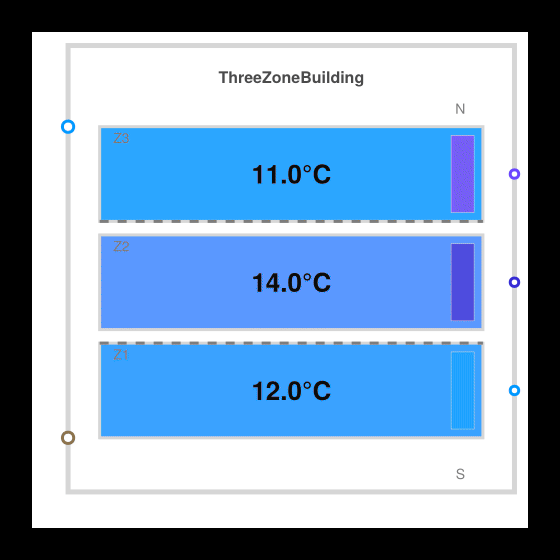

# DynamicSteadyState


A three-zone commercial office building thermal library built with
[Dyad](https://help.juliahub.com/dyad). One envelope model — a south zone, a
core zone, and a north zone, sharing partition walls — serves two workflows that
usually live in separate tools:

- **Sizing.** A steady-state solve reads off how much heating capacity each zone
  needs on the coldest day.
- **Operation.** A 24-hour transient run puts thermostats sized from that answer
  against a day of changing weather and occupancy.

Doing sizing and operation off one model is the point of the demo.



## Getting Started

Download this folder to your machine and open it in VS Code with the [Dyad
extension](https://help.juliahub.com/dyad/dev/getting_started/).

## Models

Everything is defined in one file,
[`dyad/building_model.dyad`](./dyad/building_model.dyad):

- **`ZoneRoom`** — One lumped zone: wall, window, roof, slab, and infiltration
  resistors running
  from outdoor and ground boundary signals into a single thermal mass, exposed
  as one acausal
  `zone_port`. Interior zones set `R_wall`/`R_win` to `1e6` to remove the
  exterior path.

- **`ThreeZoneBuilding`** — Three `ZoneRoom` blocks joined by two partition
  resistors (`R = 0.01`).
  Zone 1 (south) and zone 3 (north) face outdoors with `C = 400 kJ/K`; zone 2
  (core) is interior
  with `C = 300 kJ/K`. HVAC strategy lives outside this model, which is what
  lets every analysis
  reuse it unchanged: each zone just exposes a `HeatPort` for HVAC and gains.

- **`HeatCapacitorNoInit`** — A heat capacitor that leaves its initial condition
  to the caller. The
  steady-state solve then stays free of over-determined initialization while the
  transient harness
  supplies its own cold-start temperatures.

- **`ThermostatHeater`** — Proportional heating-only actuator, `Q =
  clamp(K·(T_set − T), 0, Q_max)`.

- **`OfficeOccupancy`** — Representative weekday occupancy fraction, ramping
  linearly between
  hourly breakpoints:

  - empty until 05:00
  - 0.95 from 08:00 through the morning
  - 0.50 lunch dip at 12:00
  - 0.95 again from 13:00 through the afternoon
  - decaying to 0.05 overnight

  The same breakpoints are tabulated in
  [`data/ashrae_office_occupancy.csv`](./data/ashrae_office_occupancy.csv) for
  reference.

## Analyses

| Analysis | Harness | Kind | Boundary conditions |
|---|---|---|---|
| `HVACSizing` | `TestSteadySizing` | Steady state | Occupied design day — outdoor −5 °C, ground 10 °C, peak internal gains 600 / 500 / 400 W, design solar 1500 W south and 375 W north |
| `ColdNightSizing` | `TestColdNightSizing` | Steady state | Unoccupied cold night — outdoor −10 °C, ground 10 °C, no internal or solar gains |
| `DiurnalOperation` | `TestDiurnalOperation` | Transient, `stop = 86400.0` | Daily outdoor sine −10 → 0 °C, noon-peaking solar 0–3000 W south and 0–750 W north, internal gains of occupancy fraction × peak watts, 12 °C cold start |

Both sizing solves pin `FixedTemperature` at 21 °C (294.15 K) on all three zone
ports and read the
resulting port heat flow as the required capacity — no controller or equipment
model involved. They
differ only in their boundary conditions, and the cold night governs every zone:

| Zone | Design day | Cold night | Heater `Q_max` (× 1.2 safety factor) |
|---|---|---|---|
| 1 (south) | 4274 W | 7558 W | 9070 W |
| 2 (core) | 1150 W | 1925 W | 2310 W |
| 3 (north) | 5166 W | 7041 W | 8450 W |

The transient harness sizes its three `ThermostatHeater` units from that last
column at
`K = 5000 W/K`, holding the same 21 °C setpoint.

## Running Experiments

Each analysis is exported and callable from the REPL:

```julia
using DynamicSteadyState, Plots
plot(DiurnalOperation())              # full 24-hour cycle
plot(DiurnalOperation(stop = 43200))  # first half of the day
```

[`scripts/analysis-notebook.ipynb`](./scripts/analysis-notebook.ipynb) loads the
library through `DyadOrchestrator` and runs any analysis in it. Set
`analysis_name` to one of the names the `list_analyses` cell prints —
`"HVACSizing"`, `"ColdNightSizing"`, or `"DiurnalOperation"` — and run the
cells.

[`scripts/generate_diurnal_3d_gif.jl`](./scripts/generate_diurnal_3d_gif.jl)
renders the diurnal
solution as an isometric building animation with zone-temperature and
heater-power strip charts.

## Further Reading

- [`docs/index.md`](./docs/index.md) — Model overview with an interactive
  `ThreeZoneBuilding`
  diagram viewer and a runnable diurnal example.
