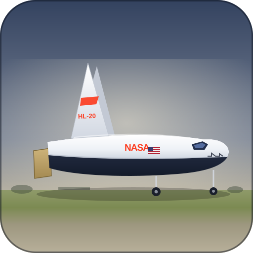

# NASA HL-20 in Dyad — Built by the Dyad Agent

This project shows how a 6-DOF flight simulation of the **NASA HL-20 lifting
body** can be
built *from scratch* by prompting the **Dyad Agent** — no model code written by
hand.

It is meant as a starting point for new users: read the two prompts, see what
the agent
produced, and try it yourself.

## How it works

The whole project is generated from two prompts, both kept in `scripts/`:

1. **`prompt.md`** — *build the models.* Asks the agent to create the plant
   (rigid-body
   dynamics, atmosphere, aerodynamics), the flight-control laws, the
   control-surface mixer,
   and a set of validation analyses, working from the engineering spec in
   `assets/shared/hl20_spec.md`.

2. **`prompt_pitchpulsesim.md`** — *simulate and plot.* Asks the agent to run
   the closed-loop
   pitch-pulse maneuver and produce a summary plot of the signals of interest.

The agent reads the spec, writes the Dyad components into `dyad/`, compiles
them, and
validates each piece in Julia before moving on.

## Try it

1. Open this folder in VS Code with the
   [Dyad extension](https://help.juliahub.com/dyad/dev/getting_started/).
2. Open the Dyad Agent and configure the Context setting to 1M tokens
3. Paste the contents of `scripts/prompt.md` to build the models.
4. Paste the contents of `scripts/prompt_pitchpulsesim.md` to simulate and plot.
