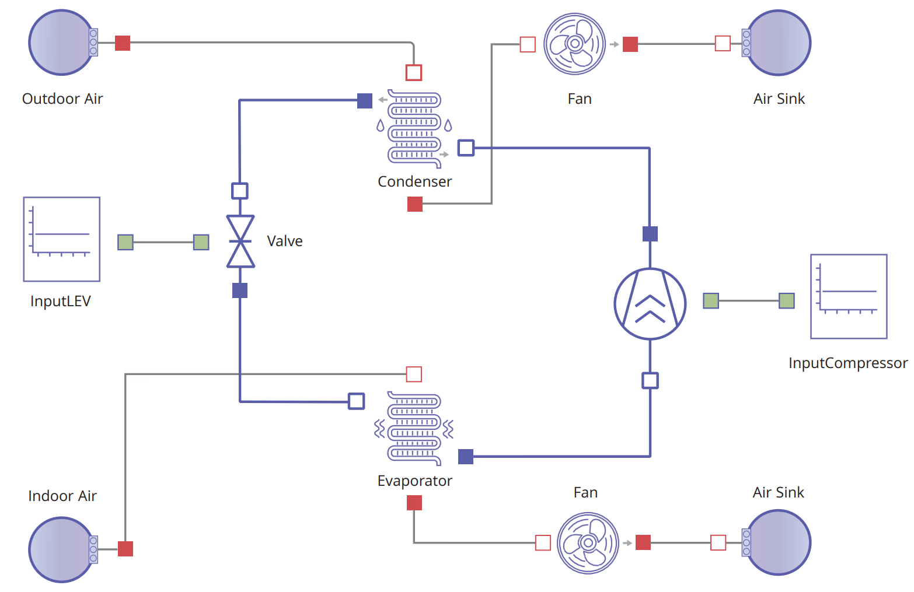

# HVACDemo



This project is a vapor-compression refrigeration cycle model built with Dyad and ModelingToolkit. It models a complete HVAC cycle with a refrigerant loop (R32) exchanging heat with two moist-air streams. The cycle consists of a compressor, a tube-fin condenser, a linear expansion valve (LEV), and a tube-fin evaporator connected in a closed loop, with moist-air sources and sinks supplying conditioned air to each heat exchanger. Controls are fixed (open-loop): compressor speed and valve position are driven by constant signal blocks rather than feedback controllers. The domain physics come from the `HVACComponents` library; signal sources come from `BlockComponents`.

The model carries extensive start-value parameters for refrigerant pressures and enthalpies, wall and air thermal properties, and per-segment heat-exchanger discretization, reflecting the stiff initialization typical of two-phase refrigerant and moist-air models.

## Getting Started

Download this folder to your machine and open it in VS Code with the [Dyad extension](https://help.juliahub.com/dyad/dev/getting_started/).

## Models

`CompleteCycleFixedControls` (`dyad/CompleteCycleFixedControls.dyad`) is the top-level model: a closed refrigerant loop (compressor → condenser → LEV → evaporator → compressor) with a separate moist-air stream flowing across each heat exchanger. The refrigerant is R32, supplied via `HVACComponents.SimpleRefrigerantPropertiesLibrary`; the air uses the moist-air medium. The two heat exchangers are discretized into `nSeg = 8` segments with `nTube = 1` and `n_flows = 4` distributor flows.

#### CompleteCycleFixedControls Components

| Instance | Type | Role |
|---|---|---|
| `compressor` | `HVACComponents.Components.Compressor` | Drives the refrigerant circuit; compresses suction vapor to discharge pressure |
| `compressor_speed_signal` | `BlockComponents.Sources.Constant` | Fixed compressor speed command (k = 10.0) |
| `condenser` | `HVACComponents.Components.TubeFinHEX` | Tube-fin heat exchanger rejecting heat from refrigerant to moist air |
| `condAirSource` | `HVACComponents.Components.Sources.MassFlowSource_TPhi` | Condenser air supply (temperature + relative humidity + mass flow) |
| `condAirSink` | `HVACComponents.Components.Sources.Boundary_pTPhi` | Condenser air outlet boundary (pressure/temperature/humidity) |
| `LEV` | `HVACComponents.Components.LEV` | Linear expansion valve throttling refrigerant from condenser to evaporator |
| `LEV_position_signal` | `BlockComponents.Sources.Constant` | Fixed valve position command (k = 220.0) |
| `evaporator` | `HVACComponents.Components.TubeFinHEX` | Tube-fin heat exchanger absorbing heat from moist air into refrigerant |
| `evapAirSource` | `HVACComponents.Components.Sources.MassFlowSource_TPhi` | Evaporator air supply (temperature + relative humidity + mass flow) |
| `evapAirSink` | `HVACComponents.Components.Sources.Boundary_pTPhi` | Evaporator air outlet boundary (pressure/temperature/humidity) |

The refrigerant ports form the loop (`compressor.port_b → condenser → LEV → evaporator → compressor.port_a`); each heat exchanger's air ports connect its dedicated source and sink. The model file also defines the analysis used to run it.

## Running the Demo

**`scripts/main.jl`** runs the `CompleteCycleFixedControls_SRP_Analysis` analysis — a `TransientAnalysis` over `t = 0 … 1400` s using the `Rodas5P` stiff solver with R32 as the working refrigerant — and plots a 2×3 overview of the cycle. The script also illustrates the basic pattern for accessing results:

```julia
result = CompleteCycleFixedControls_SRP_Analysis()
sol   = result.sol                  # the underlying ODESolution
model = symbolic_container(result)  # index variables by name
sol[model.compressor.shaftPower]    # → a time series
sol.t                               # → the time vector
```

The six panels show refrigerant pressures (high/low side), refrigerant mass flow (compressor vs. expansion valve), compressor shaft power, refrigerant temperatures (discharge/suction), air outlet temperatures (condenser air heated, evaporator air cooled), and the compressor pressure ratio. The figure is saved as `cycle_overview.png` in the prject root directory.

Run it from the project root with the project environment active:

```
julia --project=. scripts/main.jl
```

or from a REPL with `include("scripts/main.jl")`.

Notes:
- The first run compiles and integrates a stiff two-phase + moist-air model, so expect it to take a few minutes.
- During early initialization you may see `Input P=… must be in the interval … Returning NaNs` warnings from the refrigerant property library being probed at out-of-range states during startup; these clear once the solve settles (`sol.retcode == Success`).

**`scripts/analysis-notebook.ipynb`** provides an interactive environment to run the analysis and plot variables of interest.
