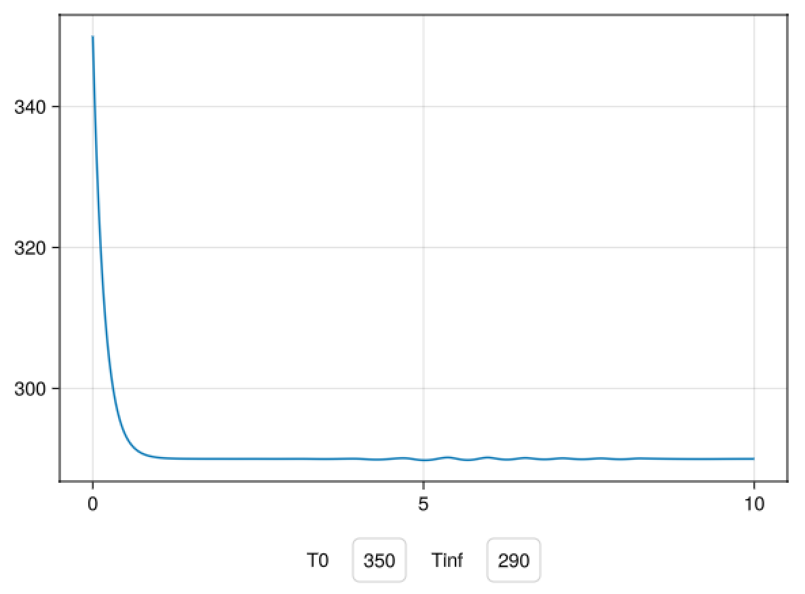

# MakieWebinar


How do you put a live plot in front of a simulation — a dashboard with sliders,
a curve that redraws as you type a new number, a parameter sweep you can watch?

This tutorial answers that, using [Makie](https://docs.makie.org/) for the
plotting and [Dyad](https://help.juliahub.com/dyad) models for the physics
underneath. It starts at your first figure and ends at animated 2D simulations.
It accompanies a webinar given in January 2026.



## Read the scripts, in this order

The tutorial *is* the `scripts/` directory. Each file stands alone, runs as-is,
and is written to be read top to bottom.

### 1. `01_intro.jl` — Makie on its own
The plotting fundamentals, with no Dyad model in sight:

- how a figure, an axis and a plot fit together
- observables: change one value and every plot showing it redraws itself
- driving those updates from a clock tick
- recording an animation to a video file
- arranging several axes alongside sliders and dropdown menus

### 2. `02_plot_solutions.jl` — plotting a simulation
Runs a Dyad model forward in time and hands the result straight to Makie: a
labelled time series, then a phase plot of one variable against another.

### 3. `03_paramsweep.jl` — dashboards with live parameters
Change a parameter, get a new curve. Four ways to build that, each faster than
the last:

1. **Re-run the whole analysis** — simplest, and slow.
2. **`remake` + `solve`** — update just the parameter that changed, then
   re-solve. Fast.
3. **Slider grids** — the same, driven by sliders rather than a text box.
4. **ComputeGraph** — wires input to solver to plot as a dependency graph, so
   only what actually changed recomputes.

### 4. `04_input_realtime.jl` — feeding inputs to a running model
A sketch, not yet finished: sets up the controlled oscillator so a controller's
gains can be changed while the simulation runs.

### 5. `05_autotuning_analysis.jl` — a ready-made designer
Opens the DyadControlSystems PID autotuning designer on a stock suspension
example. A finished app to try, rather than one you assemble.

### `visualize_flat_mesh.jl` — animating a 2D simulation
Side-by-side surface and heatmap animations of a 20x20 grid of interacting
cells. The technique worth stealing: build the mesh once, then recolour it each
frame.

## The models

`dyad/` holds the models the scripts drive. They exist to give the plots
something to show:

| File | Description |
|------|-------------|
| `hello.dyad` | Lumped thermal model (Newton's law of cooling) with adjustable ambient temperature and heat transfer coefficient. |
| `spring_mass.dyad` | Spring-mass system with an external step-force input. |
| `controlled_oscillator.dyad` | Undamped spring-mass oscillator with a PID damping controller. Includes test cases for strong, weak, and no damping. |
| `rc_circuit.dyad` | Tunable RC charging circuit. Tests fast, medium, and slow charging via different resistance values. |
| `rlc_resonance.dyad` | RLC resonant circuit showing underdamped, critically damped, and overdamped transient responses. |
| `diffusion_2d.dyad` | 2D diffusion on a grid using custom connector/component primitives (DiffusionPort, DiffusionCapacitor, DiffusionResistor). Includes 5x5 and 100x100 grid tests, plus FitzHugh-Nagumo excitable-media variants. |
| `reaction_diffusion.dyad` | Reaction-diffusion models with exponential growth and FitzHugh-Nagumo traveling-wave dynamics on 5x5 and 20x20 grids. |

## Getting Started

Download this folder to your machine and open it in VS Code with the [Dyad
extension](https://help.juliahub.com/dyad/dev/getting_started/).

## Project Structure

```
MakieWebinar/
  scripts/       -- the tutorial; start here
  dyad/          -- Dyad model source files (.dyad)
  generated/     -- Auto-generated Julia code from Dyad models
  src/           -- Module definition (re-exports generated code)
  test/          -- Test runner (executes generated model tests)
  plots/         -- Output images
  assets/        -- (reserved for additional assets)
```

## Dependencies

Key dependencies (see `Project.toml` for the full list):

- **Makie / GLMakie / WGLMakie / CairoMakie** -- plotting and interactive
  visualization
- **DyadInterface / DyadExampleComponents / DyadControlSystems** -- Dyad model
  compilation and simulation
- **ModelingToolkit / ModelingToolkitInputs** -- symbolic model manipulation and
  `remake`
- **ElectricalComponents / TranslationalComponents / BlockComponents** -- Dyad
  standard-library component packages
- **GeometryBasics** -- mesh construction for the 2D spatial visualizations
