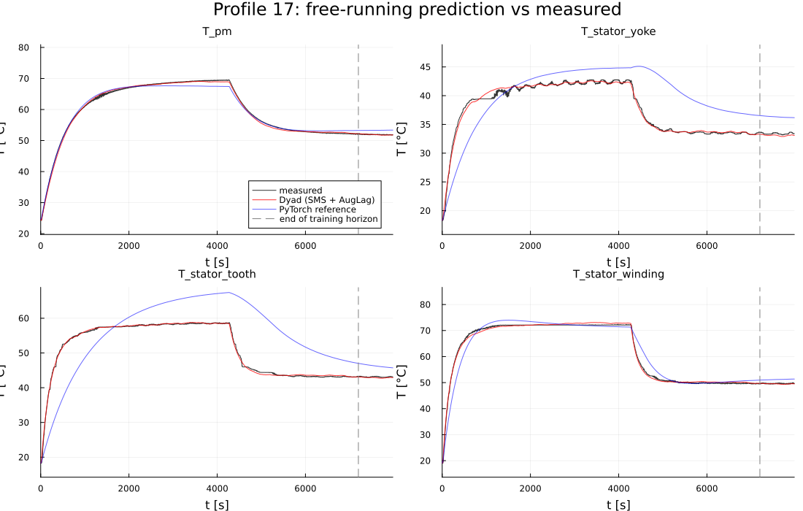
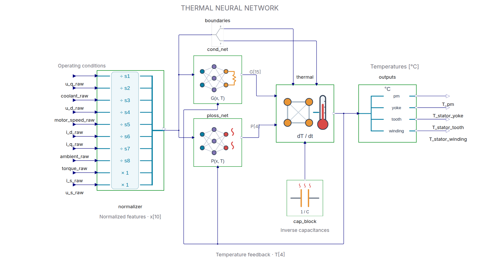
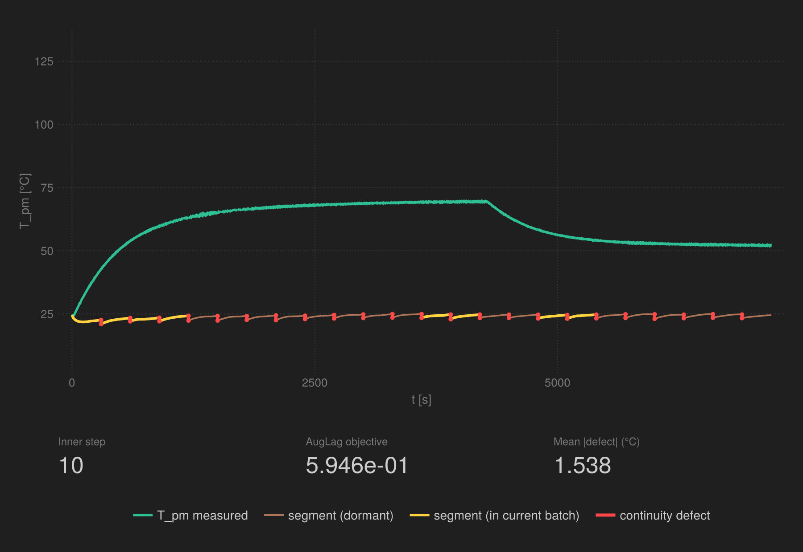
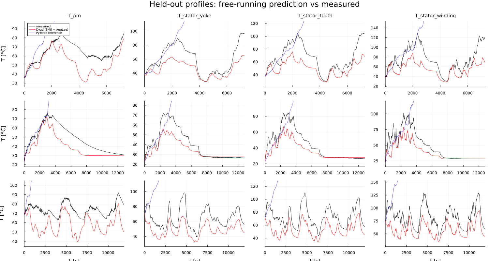

# MotorTemperatureSciML

Estimate four internal electric-motor temperatures from measured operating
conditions. Two small neural networks estimate heat generation and heat
transfer; a thermal model integrates these into temperature predictions.
This Dyad demo shows how to train that combined model and check its accuracy
in a continuous simulation.

The shipped fit is accurate on its training profile, but errors on unseen
profiles remain around **9–28 °C RMS**. This is a demonstration of training
and validation using a single drive profile; it does not reproduce the
published model's generalization performance from much broader training data.



## Try the demo

The input profiles, calibrated parameters, and reference predictions are
included. **You can validate the saved fit without training or downloading data.**

Set the JuliaHub juliaup environment variables once per shell (not needed for
the VS Code REPL command), then instantiate the standalone project:

```bash
export JULIAUP_SERVER="https://juliahub.com/juliabin"
export JULIAUP_DEPOT_PATH="$HOME/.julia/juliaup-depots/juliahub.com"
cd MotorTemperatureSciML
julia +dyad-3.3.0 --project -e 'using Pkg; Pkg.instantiate()'
```

### View the saved fit

```bash
julia +dyad-3.3.0 --project scripts/validate_calibration.jl
```

This reads `assets/data/calibrated_params.csv`, reports RMS errors, and writes
four plots to `runs/validation/`. Start with `validation_training_profile.png`
and `validation_test_profiles.png`. Initial package loading and compilation
can take a few minutes. Each profile starts from its first measured temperatures
and then runs continuously, without resetting at the end of the training horizon.

### Check the training pipeline

```bash
TNN_BUDGET=quick JULIA_NUM_THREADS=8 julia +dyad-3.3.0 --project scripts/train_stochastic_ms.jl --out-dir runs/quick
julia +dyad-3.3.0 --project scripts/validate_calibration.jl --calibration runs/quick/calibrated_params.csv --out-dir runs/quick
```

The quick budget takes about a minute on the measured machine, including
compilation. It checks that the pipeline works; it is too short for an accurate
fit. The second command evaluates this quick fit explicitly.

### Retrain the full model

```bash
JULIA_NUM_THREADS=8 julia +dyad-3.3.0 --project scripts/train_stochastic_ms.jl --out-dir runs/full
julia +dyad-3.3.0 --project scripts/validate_calibration.jl --calibration runs/full/calibrated_params.csv --out-dir runs/full
```

Full training takes about 21 minutes on the measured machine. See
[training settings](#training-settings-and-performance) for the shorter budget
and thread-count measurements.

All run outputs go under the gitignored `runs/` directory by default. Training
without `--out-dir` writes to `runs/training/`. Validation defaults to the
**shipped calibration**, even after a training run; select your new fit with
`--calibration`. `--out-dir` selects where each script writes its results;
relative paths are relative to the working directory. Reusing a run directory
replaces its previous outputs. The committed data and README plots remain intact.

## How the model works

The TNN estimates four internal temperatures of a permanent-magnet
synchronous motor (rotor magnet, stator yoke, stator tooth, stator winding)
from ten measured operating conditions (voltages, currents, speed, torque,
coolant and ambient temperature). It is a lumped-parameter thermal network,
a 6-node heat-transfer ODE, whose coefficients are produced by small neural
networks:

| Block | Role | Trained parameters |
|---|---|---|
| `Networks/ConductanceNet` | thermal conductances of the 15 edges of the fully connected 6-node graph | `Dense(14 → 15, sigmoid)`, 225 |
| `Networks/PowerLossNet` | heat generation at the 4 target nodes | `Dense(14 → 16, tanh) → Dense(16 → 4, abs)`, 308 |
| `Thermal/CapacitanceBlock` | inverse thermal capacitances, `exp.(caps)` (log-space keeps them positive) | 4 |
| `Thermal/ThermalDynamics` | fixed physics: `C·dT/dt = Σ G·ΔT + P` | – |
| `Thermal/Normalizer` | fixed feature scaling: temperatures divided by 200, signed signals by max-abs constants | – |
| `Thermal/TemperatureOutputs` | converts the four normalized states to named outputs in °C | – |



The diagram keeps feature and temperature vectors bundled, with temperature
feedback below the neural networks. Explicit junctions mark shared signals;
`BoundaryTemperatures` selects coolant and ambient from the feature vector.
Inside each neural network, `FeatureMux` concatenates `[x; T]` before the NN.
The profile harness uses named demux outputs to keep the ten scalar input wires
separate and aligned. These routing components are local to this demo.
The normalizer shows one row per input: `s1`–`s8` are the corresponding
feature scales, while the two pre-normalized magnitude features pass through.
The matching neural-network icons distinguish conductance (a thermal
resistance) from power loss (heat waves); the output block groups the four
conversions to °C.

[Profile wiring](assets/profile_schematic.png) ·
[Neural-network input mux](assets/network_schematic.png)

`TNNModel.MAX_TEMP` sets the scale for both normalization and output conversion.
The calibration scripts use the fixed 200 °C convention of the reference model.

## How it is trained

This is a Dyad port of the Thermal Neural Network (TNN) of Kirchgässner,
Wallscheid & Böcker. It is trained on the public Paderborn PMSM dataset and
compared with a port of the reference PyTorch implementation.

Fitting a two-hour profile by single shooting is slow and badly conditioned:
the loss landscape over the network weights is dominated by how early errors
compound along the trajectory. `scripts/train_stochastic_ms.jl` instead uses
`StochasticMultipleShooting`:

- the 2 h horizon is cut into 96 segments of 75 s, each with its own free
  initial state;
- every Adam step samples a mini-batch of 32 segments in contiguous blocks of
  4 and solves them in parallel on a pool of integrators;
- continuity at the 95 segment junctions is imposed as a constraint by an
  augmented Lagrangian outer loop (`OptimizationAuglag.AugLag`); each outer
  iteration updates the multipliers and penalty, and the inner problem is
  minimised by Adam;
- gradients are ForwardDiff over the mini-batch, with the differentiated
  parameter buffer restricted to the 537 trained values.



Gold segments are the ones in the current mini-batch, red bars are the
continuity defects the augmented Lagrangian shrinks. A four-panel version with
the training curves and per-junction defects is in
[`assets/sms_training_detailed.gif`](assets/sms_training_detailed.gif).
The animation is a separate, coarser run chosen so that individual segments
are visible: 24 segments of 300 s instead of 96 of 75 s, mini-batches of 8,
and 10 outer iterations of 33 epochs (990 steps, about 10 min). Its final
frame sits 2–3 °C below the rotor plateau, short of the 0.4 °C the full
calibration reaches; the GIF shows the mechanics, the results below show the
fit.

The training-time objective is not the model's accuracy: it mixes data misfit
with penalty terms and is evaluated with segment initial states that are stale
right after a multiplier update. `scripts/validate_calibration.jl` therefore
runs the calibrated model as a plain ODE over the whole training profile and
over three held-out profiles, and compares with the reference PyTorch TNN
trained on the same 0–7200 s interval of profile 17 for 100 epochs (see the note on
multi-profile training under Results).

## Results

Free-running RMS error in °C. The Dyad run is 5 outer iterations × 100
epochs, 1500 Adam steps over mini-batches of 32 segments, 21 min on 8
threads. The PyTorch column is the reference implementation trained on the
same 0–7200 s interval for 100 epochs of truncated BPTT over 512-sample chunks:
14,401 samples, 29 chunks per epoch, 2900 updates, 144 s on the same machine
(`scripts/train_pytorch_reference.py --threads 24`, seed 0). Both models exclude
the remainder of profile 17 from training and evaluate it free-running, with
no state reset at 7200 s. These are individual runs, not averages over seeds.
An epoch covers the same two-hour interval in both cases, but the optimization
work differs: a Dyad step integrates 32 segments with an adaptive solver and
differentiates through them with ForwardDiff; a TBPTT update takes up to 512
explicit Euler steps. Solver, initialization, thread count, and training budget
also differ, so this compares the two workflows rather than isolating framework
speed or optimizer quality.

| Profile | | T_pm | T_stator_yoke | T_stator_tooth | T_stator_winding |
|---|---|---|---|---|---|
| 17, training horizon (0–7200 s) | Dyad | 0.42 | 0.42 | 0.37 | 0.60 |
| | PyTorch | 0.92 | 4.60 | 9.65 | 2.69 |
| 17, held-out tail (7200 s–end) | Dyad | 0.10 | 0.33 | 0.23 | 0.17 |
| | PyTorch | 1.36 | 2.92 | 3.20 | 1.55 |
| 60 (held out) | Dyad | 15.2 | 16.5 | 20.1 | 25.8 |
| | PyTorch | 139.8 | 103.2 | 148.6 | 169.4 |
| 62 (held out) | Dyad | 10.5 | 8.6 | 10.5 | 13.6 |
| | PyTorch | 212.5 | 153.8 | 244.0 | 259.0 |
| 74 (held out) | Dyad | 17.6 | 16.4 | 21.2 | 27.6 |
| | PyTorch | 198.4 | 146.0 | 229.7 | 232.1 |



Both models trained on the first 2 h of a *single* 2.2 h profile. The published TNN results are
obtained very differently: the upstream notebook trains on the whole Paderborn
training set, 66 profiles and 176 h of data, and generalises to the held-out
profiles far better than either column here. Training over several profiles
at once, one experiment per profile inside the stochastic multiple-shooting
loop, is not yet supported on the Dyad side, so this demo trains on one
profile and uses the other three only as a stress test. On that test the Dyad
fit stays bounded and tracks the shape of the unseen profiles with a 9–28 °C
error; the reference fit runs away on all three (its curves leave the frame in
the figure above, whose axes follow the measurement). The two share the same
architecture and both are trained over the same two-hour horizon (the notebook's
truncated BPTT carries the state across chunks), so the difference lies
elsewhere: the reference steps the ODE with explicit Euler at the 0.5 s
sample rate and clips its outputs, the Dyad model is integrated adaptively;
the capacitances start from different scales; and the shooting fit imposes
continuity constraints at 95 junctions. Which of these keeps the Dyad fit bounded
on unseen operating conditions is not established here. The
segment-continuity residuals of the shooting fit
([`assets/validation_continuity.png`](assets/validation_continuity.png)) are
the diagnostic to watch during training: they end up within ±0.14 °C with no
systematic sign, which is what lets the segment-wise fit carry over to the
free-running simulation, and is the criterion the run stops on. The fitted
log-capacitances moved from the initial −5.0 to −5.6 / −5.2 / −5.2 / −5.3.

## Implementation details

The model has 537 trained parameters in total. The network blocks are wrapped with
`ModelingToolkitNeuralNets.NeuralNetworkBlock` (via `DyadModelDiscovery`), so
ModelingToolkit sees each network as one opaque callable over a single
parameter vector. Measured signals enter through `FastVectorInterpolation`
(`dyad/definitions.jl`), a multi-channel interpolation block stored as a
concretely typed callable parameter: one time search per RHS call and no
boxing under ForwardDiff.

## Training settings and performance

The full training run uses stochastic mini-batch multiple shooting with an
augmented Lagrangian, via `DyadModelOptimizer`. The timing guidance below is
specific to the measured machine and workload.

More threads is not faster here. The CPU used, an i9-14900K, has 8
performance cores and 16 efficiency cores, and the optimum is one thread per
performance core. Wall-clock per epoch (one pass over the 96 segments, batch
32, after warm-up):

| Julia threads | 4 | 8 | 12 | 16 | 24 | 32 |
|---|---|---|---|---|---|---|
| s / epoch | 2.55 | **2.33** | 2.65 | 2.90 | 4.17 | 3.24 |

Each step waits for its slowest segment, so any thread scheduled on an
efficiency core or a hyperthread holds the whole batch back. On a machine
with uniform cores, use one thread per physical core. Keep `BATCH_SIZE = 32` even
on small machines: the per-step cost is dominated by the full-batch constraint
Jacobian, so a smaller batch costs almost as much per step and needs more
steps per epoch (batch 8 on 8 threads: 6.75 s / epoch).

`TNN_BUDGET` selects the training budget (8 threads; RMS is the free-running
error on the training horizon):

| `TNN_BUDGET` | outer × epochs | Adam steps | time | RMS pm / yoke / tooth / winding [°C] |
|---|---|---|---|---|
| `quick` | 1 × 2 | 6 | ~1 min incl. compile | pipeline check only |
| `short` | 10 × 12 | 360 | ~5 min | 4.1 / 0.8 / 0.9 / 3.1 |
| `full` (default) | 5 × 100 | 1500 | ~21 min | 0.42 / 0.42 / 0.37 / 0.60 |

The validation script can also be `include`d in the session that just trained;
it then uses the in-memory `calres`, unless `--calibration` explicitly selects
a file.
The augmented Lagrangian stops with `Success` once every segment junction has
closed to within `CONTINUITY_TOL_C = 0.2 °C` (`scripts/common.jl`); if it
runs out of outer iterations first it reports `ConvergenceFailure`. `Success`
certifies continuity, not accuracy: the junctions can close while the data
fit is still improving, so the free-running validation is the accuracy
measure either way.

To regenerate the training animation in a separate run directory:

```bash
JULIA_NUM_THREADS=8 julia +dyad-3.3.0 --project scripts/animate_sms_training.jl --out-dir runs/animation
```

This writes the GIFs, final-frame PNGs, and reusable snapshot cache there.
Use `FORCE_RETRAIN=1` to refresh a cached animation run.

| Path | Purpose |
|---|---|
| `dyad/` | Model: `Models/TNNModel.dyad`, the `Networks/` and `Thermal/` blocks, `FastVectorInterpolation` (external component, implemented in `dyad/definitions.jl`), and the `TestTNNProfile` harness that drives the model from a profile Parquet file |
| `src/chains.jl` | Lux chains of the two networks |
| `scripts/common.jl` | Shared setup: segmentation, `Experiment` / `InverseProblem` / algorithm builders |
| `scripts/train_stochastic_ms.jl` | Calibration run |
| `scripts/validate_calibration.jl` | Free-running validation and plots |
| `scripts/animate_sms_training.jl` | Training animation |
| `scripts/prepare_data.jl` | Re-slice profiles from `measures_v2.csv` into Parquet |
| `scripts/train_pytorch_reference.py` | The reference PyTorch TNN trained on the same profile; writes new predictions under `runs/` |
| `assets/data/` | Shipped profiles, calibration, and PyTorch reference predictions |
| `runs/` | Local calibration, validation, and animation outputs (gitignored) |

Tests: `julia +dyad-3.3.0 --project -e 'using Pkg; Pkg.test()'`.

### Reproducing the PyTorch reference

The shipped reference predictions in `assets/data/pytorch_profile_<id>.parquet`
were written by a port of the upstream notebook's training and evaluation cells,
restricted to the first 7200 s of profile 17. It reads the shipped profile files, so no download is
needed, and declares its dependencies inline; `uv` builds a CPU-only
environment on first use:

```bash
uv run scripts/train_pytorch_reference.py --threads 24 # ~2.5 min, → runs/pytorch/pytorch_profile_<id>.parquet
```

Without `uv`, install `scripts/requirements.txt` into a virtualenv and run the
script with `python`. `--epochs`, `--threads`, `--seed` and `--out-dir` are
the useful knobs; `--no-export` trains and reports without writing files.
New predictions go to `runs/pytorch/` by default. Validation overlays the
shipped reference predictions; regenerating them into a run directory does
not replace that reference.
`--train-horizon` defaults to 7200 s, matching `TRAIN_HORIZON_S` in
`scripts/common.jl`; change both when comparing a different horizon. Evaluation
and exported predictions always cover each full profile. Run the Python regression
checks as `python test/test_reference.py` in the reference environment.

## Data

The **Paderborn PMSM temperature dataset**
([Electric Motor Temperature](https://www.kaggle.com/datasets/wkirgsn/electric-motor-temperature)
on Kaggle, DOI `10.34740/KAGGLE/DSV/2161054`, by the TNN authors): 185 hours
of test-bench measurements at 2 Hz across 69 drive profiles. `assets/data/`
ships the training profile (`profile_17.parquet`) and the three held-out profiles
the upstream notebook evaluates on (`profile_60/62/74.parquet`), sliced by
`scripts/prepare_data.jl`. The files are zstd-compressed
[Parquet](https://parquet.apache.org/) with the full Float64 precision of the
source, about a third of the equivalent CSV; read them with
`Parquet2.Dataset(path)` in Julia or `pandas.read_parquet(path)` in Python.
`pytorch_profile_<id>.parquet` are the free-running
predictions of the reference implementation ([wkirgsn/thermal-nn](https://github.com/wkirgsn/thermal-nn),
`TNN_pytorch.ipynb`) after training on the first 7200 s of profile 17 for 100 epochs, on the
same 0.5 s grid, as written by `scripts/train_pytorch_reference.py` (seed 0).

## References

- W. Kirchgässner, O. Wallscheid, J. Böcker, *Thermal neural networks:
  Lumped-parameter thermal modeling with state-space machine learning*,
  Engineering Applications of Artificial Intelligence 117 (2023) 105537.
  DOI [10.1016/j.engappai.2022.105537](https://doi.org/10.1016/j.engappai.2022.105537),
  preprint [arXiv:2103.16323](https://arxiv.org/abs/2103.16323).
- Reference implementation (PyTorch/TensorFlow/Matlab):
  [github.com/wkirgsn/thermal-nn](https://github.com/wkirgsn/thermal-nn).
