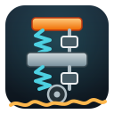

# DyadDemos

Dyad is a modeling and simulation platform. You describe a physical system — a
brake, a car suspension, a house losing heat — as a diagram of connected parts.
Dyad turns that diagram into equations it can simulate, tune, and fit to real
measurements.

This repository holds full-sized demos of that workflow. Each one is a
standalone project: open the folder, run it, and read its own README.

| | Demo | Description |
|---|---|---|
|  | [**FrictionBrakeDemo**](./FrictionBrakeDemo/) | A vehicle friction brake system with thermal effects and a cycle test. |
|  | [**TurkeyDemo**](./TurkeyDemo/) | A discretized thermal model of a turkey cooking in an oven, with an interactive dashboard. |
|  | [**CoffeeMugDemo**](./CoffeeMugDemo/) | A modular thermal simulation of espresso cooling in a cup, with optional spoon and steam subsystems. |
|  | [**HybridTransmission**](./HybridTransmission/) | A torque-split hybrid transmission model with ECMS control strategy over an EPA highway drive cycle. |
|  | [**MakieWebinar**](./MakieWebinar/) | Demonstrations of using Makie interactive plotting with Dyad models, including dashboards and parameter sweeps. |
|  | [**ThermalHouseDemo**](./ThermalHouseDemo/) | A residential house thermal model covering envelope heat loss, infiltration, solar gains, and HVAC control. |
|  | [**DynamicSteadyState**](./DynamicSteadyState/) | A three-zone office building thermal model with steady-state HVAC sizing and 24-hour diurnal transient operation. |
|  | [**QuarterTruckSciML**](./QuarterTruckSciML/) | A quarter-truck ride-comfort model showcasing two SciML workflows: training a neural network to recover suspension nonlinearities, and calibrating physical parameters from measurements. |
|  | [**PassiveSuspension**](./PassiveSuspension/) | A quarter of a car driving over a rough road, where the shock absorbers are tuned until the ride is comfortable enough for the person in the seat. |
|  | [**DrivelineSciML**](./DrivelineSciML/) | An electric car's driveline with a rubbery coupling nobody has measured: the demo works out how that coupling behaves from two shake tests, then checks the answer against a hard acceleration it never saw. |
|  | [**HL20Demo**](./HL20Demo/) | A flight simulation of NASA's HL-20 spaceplane, built from scratch by prompting the Dyad Agent — no model code written by hand. |
|  | [**SatelliteGNC**](./SatelliteGNC/) | A shoebox-sized satellite turning to point at a new target: it works out how fast it is already spinning, then fires eight small thrusters to swing around and hold still, both on its own and while orbiting. |
