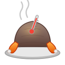
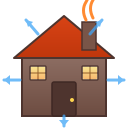
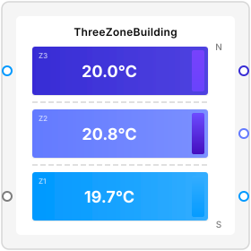
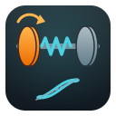

# DyadDemos

Complex, in-depth demos of the capabilities of Dyad, the new platform for modeling and simulation.

| | Demo | Description |
|---|---|---|
|  | [**FrictionBrakeDemo**](./FrictionBrakeDemo/) | A vehicle friction brake system with thermal effects and a cycle test. |
|  | [**TurkeyDemo**](./TurkeyDemo/) | A discretized thermal model of a turkey cooking in an oven, with an interactive dashboard. |
|  | [**CoffeeMugDemo**](./CoffeeMugDemo/) | A modular thermal simulation of espresso cooling in a cup, with optional spoon and steam subsystems. |
|  | [**HybridTransmission**](./HybridTransmission/) | A torque-split hybrid transmission model with ECMS control strategy over an EPA highway drive cycle. |
|  | [**MakieWebinar**](./MakieWebinar/) | Demonstrations of using Makie interactive plotting with Dyad models, including dashboards and parameter sweeps. |
|  | [**ThermalHouseDemo**](./ThermalHouseDemo/) | A residential house thermal model covering envelope heat loss, infiltration, solar gains, and HVAC control. |
|  | [**DynamicSteadyState**](./DynamicSteadyState/) | A three-zone office building thermal model with steady-state HVAC sizing and 24-hour diurnal transient operation. |
|  | [**QuarterTruckSciML**](./QuarterTruckSciML/) | A quarter-truck ride-comfort model showcasing two SciML workflows: training a neural network to recover suspension nonlinearities, and calibrating physical parameters from measurements. |
|  | [**DrivelineSciML**](./DrivelineSciML/) | An EV driveline with a nonlinear torsional isolator: two-stage calibration recovering the hidden Maxwell-branch and Bouc-Wen hysteresis parameters from designed chirp and slow-cycle excitations, validated on an unseen tip-in event. |
|  | [**HL20Demo**](./HL20Demo/) | This project shows how a 6-DOF flight simulation of the NASA HL-20 lifting body can be built from scratch by prompting the Dyad Agent — no model code written by hand. |
