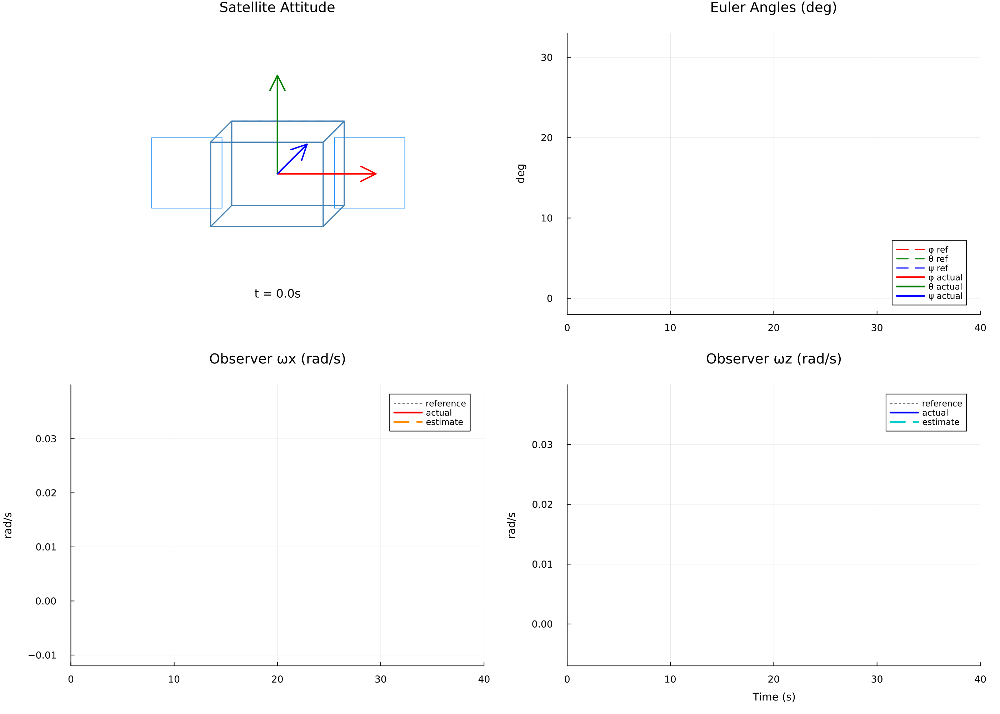

# SatelliteGNC

A small satellite has to turn and point somewhere new — 20° of roll, 10° of
pitch and 30° of yaw, all at once — then stop dead on target without
overshooting.

Stopping cleanly means knowing how fast the craft is already turning. The only
sensor aboard reports which way it points, not how fast it moves. A Luenberger
observer fills that gap. It runs a small model of the craft alongside the real
one, nudging that model into agreement with each new star-tracker reading, so
the controller can damp a spin rate nobody ever measures.

The manoeuvre ships twice. The first version applies turning force directly, as
an ideal actuator would. The second flies a 400 km orbit and steers with eight
fixed thrusters that can each only push one way, so the commanded turn has to be
shared out across them.

Comparing the two is the point of the demo: how closely each tracks, how much
authority the thrusters have, and what leaks into the orbit.

Built with [Dyad](https://help.juliahub.com/dyad).

## Getting Started

Download this folder to your machine and open it in VS Code with the
[Dyad extension](https://help.juliahub.com/dyad/dev/getting_started/).

## Models

The following Dyad models are defined in the `dyad/` directory:

- **`SatelliteBody`** (`satellite_body.dyad`) — Rigid-body rotational plant:
  Euler's equations on
  principal axes (`Ixx, Iyy, Izz = 10, 8, 6 kg·m²`) with 3-2-1 Euler-angle
  kinematics. The
  gyroscopic cross-coupling terms are retained, so multi-axis slews see the real
  coupling.

- **`SatelliteBody6DOF`** (`satellite_body_6dof.dyad`) — The same rotational
  dynamics plus two-body
  Keplerian translation in ECI (`m = 4 kg`), body-frame thrust rotated into ECI,
  and gravity-gradient
  torque from the orbital position. 12 states.

- **`TrapezoidalProfile`** (`trajectory_profile.dyad`) — Single-axis slew
  reference: accelerate at
  `a_max`, coast at `w_max`, decelerate to rest. It emits angle, rate, and
  acceleration references;
  the latter two drive rate-error damping and torque feedforward. The
  closed-loop assemblies run
  three of these at `w_max = 0.0349 rad/s` (2°/s) and `a_max = 0.00873 rad/s²`
  (0.5°/s²).

- **`AttitudeController`** (`attitude_controller.dyad`) — Per-axis PD with
  inertia feedforward,
  `τ = -Kp·(θ_meas - θ_ref) - Kd·(ω̂ - ω_ref) + I·α_ref`. Gains `Kp = 5, 4, 3`
  and `Kd = 20, 16, 12`
  put every axis at `ωn = 0.707 rad/s`, `ζ = 1.41`.

- **`LuenbergerObserver`** (`observer.dyad`) — Estimates body rates from angle
  measurements and the
  known applied torques, using a linearized single-axis copy of the plant.
  Double poles per axis at
  `-p` with `p = 2 rad/s`, giving `La = 2p` and `Lw = p²·I`.

- **`ReactionJet`** (`reaction_jet.dyad`) — One bipropellant thruster at
  body-frame position `r` with
  direction `d̂`: `F = cmd·F_max·d̂` and `τ = r × F`, with `cmd` clamped to
  `[-1, 1]`.

- **`ThrusterAllocator`** (`thruster_allocator.dyad`) — Maps commanded body
  forces and torques onto
  eight jet commands through the [pseudoinverse](https://en.wikipedia.org/wiki/Moore%E2%80%93Penrose_inverse) of the 6×8 configuration matrix — the share-out that meets the demand with the least total thrust.
  The matrix has rank
  6, so the cluster is fully 6-DOF controllable with two redundant directions.

Two closed-loop assemblies fly that maneuver. Both run the same chain for 40 s —
three slew profiles
→ controller → plant, with the observer closing the rate loop — and differ only
in how the commanded
torque reaches the spacecraft:

| Model | Analysis | Actuation | Plant |
|---|---|---|---|
| `TestFullGNC` (`full_gnc.dyad`) | `TestFullGNCSim` | Ideal torque, applied directly | `SatelliteBody`, attitude only |
| `TestFullGNC6DOF` (`full_gnc_6dof.dyad`) | `TestFullGNC6DOFSim` | `ThrusterAllocator` → 8 × `ReactionJet`, `F_max = 0.5 N` | `SatelliteBody6DOF`, 400 km circular orbit |

Each component file also defines its own standalone analysis — open-loop and
closed-loop plant
checks, one-orbit propagation, a single jet, the allocator-plus-jets cluster —
runnable the same way.
None of them declare `tests` metadata, so `Pkg.test()` currently asserts
nothing.

## Running Experiments

`scripts/analysis-notebook.ipynb` loads the library through `DyadOrchestrator`
and runs any analysis in it. Set `analysis_name` to one of the names listed by
the `list_analyses` cell, then run the cells. The two full maneuvers are
`"TestFullGNCSim"` and `"TestFullGNC6DOFSim"`.

## Further Reading

- [`notes.md`](./notes.md) — Architecture of the 3-DOF loop:
  - the plant equations
  - why the slew reference has the shape it does
  - where the observer poles go, and the separation-principle argument for
    putting them there
  - what each of the three controller terms contributes
  - the closed-loop performance recorded at the shipped defaults
- [`docs/algorithm_description.md`](./docs/algorithm_description.md) —
  Per-component specification:
  I/O tables, equations, literature references, and the test plan behind each
  component's tests.
